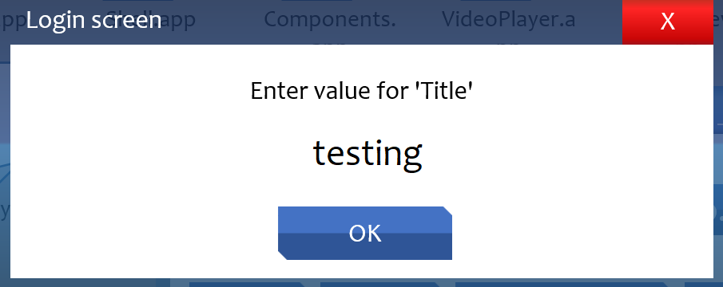
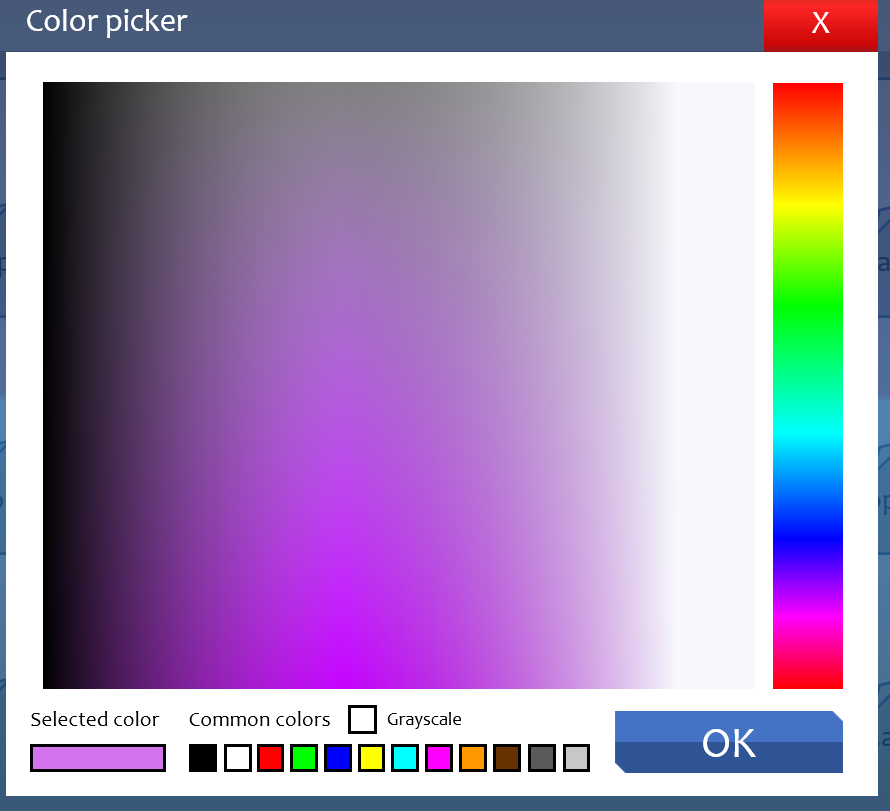
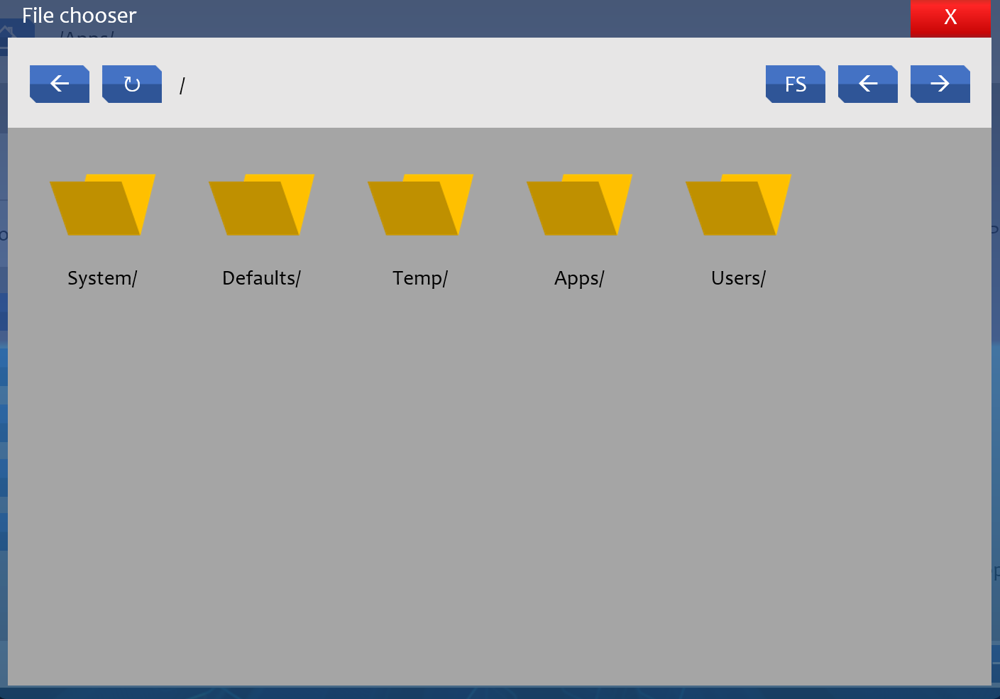

# Common dialogs

In Sunlight OS, developers can use one of the several built-in common dialogs to reduce the amount of code they have to write. Here's how you can use them:

## Table of contents

* [Message](#message)
* [InputBox](#inputbox)
* [ModalColorPicker](#modalcolorpicker)
* [ModalFiles](#modalfiles)

## Message

Displays a message to the user.


Here's how you may call it within your app:

```VB
	AppMessage "Hello world!", "My message", "Info", True
```

List of args:
* Text As String - The content of the message
* Title As String - Window title for the message box
* Icon As String - What kind of icon you want to have displayed on the message dialog. Here's a list of them: "Error", "Info", "Exclamation".
* ToDesktop As Boolean - Set this to `True` unless you want the message box to be displayed outside of the desktop slide.

## InputBox

Displays a dialog to the user where they can enter some text and click OK.



Here's how you may use it on your app:

```VB
	Sub AppHelloShowInputBox()
        SetVar "Macro", "AppHelloHandleInput"
        AppInputBox "Please enter your name:", "Hello"
	End Sub

    Sub AppHelloHandleInput()
        Dim UserInput As String
        UserInput = CheckVars("%InputValue%")
        UnsetVar "InputValue"
        AppMessage "Your name is " & UserInput & "!", "Hello!", "Info", True
    End Sub
```

Here you can see one common way you may interact with common dialogs - global variables. The "Macro" variable must be set in order for the input to be immediately recieved and handled. If the user closes the window by pressing the "X" button, it'll not run the specified macro at all.

You may also want to pass "AppID" as the global variable if you want the text to be displayed inside the app window

## ModalColorPicker

Displays a standard HSL color picker.



Here's how you may use it on your app:

```VB

    Sub AppHelloChangeColor(Shp As Shape)
        SetVar "Macro", "AppHelloConfirmColor"
        SetVar "Shape", Shp.Name
        AppModalColorPicker
    End Sub
    
    Sub AppHelloConfirmColor()
        Dim Shp As Shape
        Dim Clr As Long
        
        Set Shp = Slide1.Shapes(CheckVars("%Shape%"))
        Clr = CLng(CheckVars("%InputValue%"))
        
        Shp.Fill.ForeColor.RGB = Clr
        
        UnsetVar "Shape"
        UnsetVar "InputValue"
    End Sub
```

Once again, we only have to specify the "Macro" and recieve the color as "InputValue". However, to actually use it as a color, we must cast it with `CLng`. In the example, we also pass the shape name, which we change the fill color for.

## ModalFiles

Allows the user to choose a file for loading or to save a file.



Here's how you may use it for loading a file in your app:

```VB
    Sub AppHelloModalFiles(Shp As Shape)
        Dim AppID As String
        AppID = GetAppID(Shp)
        SetVar "Macro", "AppHelloLoadFile"
        SetVar "AppID", AppID
        UnsetVar "Save"
        AppModalFiles
    End Sub
    
    Sub AppHelloLoadFile()
        Dim AppID As String
        Dim Data As String
        AppID = CheckVars("%AppID%")
        Data = GetFileContent(CheckVars("%InputValue%"))
        Slide1.Shapes("AxTextBoxAppHello:" & AppID).TextFrame.TextRange.Text = Data
        Slide1.AxTextBox.Text = Data
    End Sub
```

And here's saving:

```VB
    Sub AppHelloSaveModalFiles(Shp As Shape)
        Dim AppID As String
        AppID = GetAppID(Shp)
        SetVar "Macro", "AppHelloSaveFile"
        SetVar "AppID", AppID
        SetVar "Save", "True"
        AppModalFiles
    End Sub
    
    Sub AppHelloSaveFile()
        Dim AppID As String
        Dim Data As String
        Dim Filename As String
        AppID = CheckVars("%AppID%")
        Data = Slide1.Shapes("AxTextBoxAppHello:" & AppID).TextFrame.TextRange.Text
        Filename = CheckVars("%InputValue%")
        Slide1.Shapes("AxTextBoxAppHello:" & AppID).TextFrame.TextRange.Text = Data
        If Right(Filename, 4) <> ".txt" Then
        	Filename = Filename & ".txt"
        End If
        SetFileContent Data, Filename
    End Sub
```

To differenciate saving from loading we either set the "Save" variable or unset it. Once again we recieve the filename from "InputValue" global variable. In the save example, we also append .txt to the end if the user didn't do it themselves. We also use `SetFileContent` and `GetFileContent` ShapeFS functions. See [ShapeFS functions](./ShapeFS functions.md) for more info.
