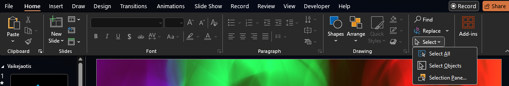
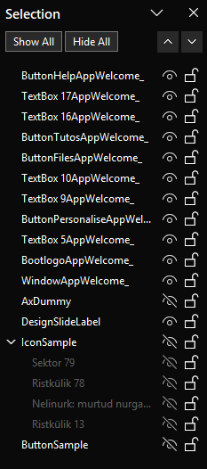
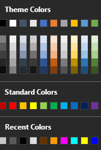

# Design guidelines

When designing apps for Sunlight OS, you must follow certain rules to avoid breaking the app. Here are the most important ones.

## No duplicate shape names

Shapes that are named the same thing cannot be easily grouped. So, it's neccessary to make sure that while designing an app or icon, every shape name is unique. Usually PowerPoint deals with this for you, however if you copy and paste shapes, duplicate names can occur. To check for duplicates, go navigate to "Home" from the ribbon and click on "Select" under "Editing" section. From the dropdown click on "Selection Pane..."

The selection pane looks like this:

From here, you can rename shapes by slow double clicking their name, entering the new name and pressing <Enter>. Please see the rest of the design guidelines before commiting to a name.

## PascalCase

Generally speaking, every name in SunlightOS should be given in PascalCase unless the name was automatically generated by PowerPoint.

## Disallowed characters and sequences

You shouldn't normally use any of the following characters: "_", ":", "*".

In addition, you shouldn't use the "App" string in a shape name, as this will create confusion unless automatically generated by aaDev macros. We recommend using  "4pp" instead if you want to use that word.

## Special names

If the shape name contains the word "Button", it'll be automatically themed as a button by Sunlight OS during runtime.

If the shape name starts with "AxTextBox", it'll be turned into a textbox where the user can type stuff during runtime.

If the shape name is "AssocIcon", it'll not be shown during runtime and instead copied to a system folder for use as a file association icon.

If the shape name is written in this form: `<Width>*<Height>*<Direction>*<ShapeName>`, its size will remain as the specified size when resizing the window. The direction can be one of the following: "N", "NE", "E", "SE", "S", "SW", "W", "NW".

## Reserved names

The following names are reserved during runtime and cannot be used for your app: "WindowFrame", "WindowTitle", "Minimize", "Close", "Handle"

## Groups

Generally speaking, we don't recommend creating any groups unless you understand that you can't access the shapes that are grouped within groups directly, so you'd need to ungroup the entire app and then regroup it again.

## Colors

For user preference reasons, we recommend using theme colors wherever possible. In the color chooser, this includes any of the colors under "Theme Colors" (including shades).

However, if you don't want the color to change with the theme, we do allow you to specify your own color.

## Bounds

All app contents should fit within the "WindowApp<AppName>_" shape. If any shapes go out of bounds, the window frame will not account for that, so it'll look weird for the user.

## Generated suffixes

Once you run `aaDevRefreshApp` macro, every shape that doesn't have `App<AppName>_` suffix, will be given one. AppName is the name you gave to the app. However, this suffix is only used for storing the app. When you actually run the app, the suffix will look like this: `App<AppName>:<AppID>`.