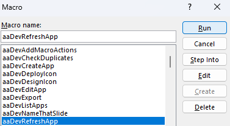

# Hello application

This tutorial shows you how to create an application that displays a window with some text on it.

## Table of contents

* [Prerequesites](#prerequesites)
	* [Separating dev environment](#separating-dev-environment)
	* [Enabling VBA code access](#enabling-vba-code-access)
	* [Enabling developer tab on the ribbon](#enabling-developer-tab-on-the-ribbon)
* [Introduction to macros](#introduction-to-macros)
* [devCreateApp](#devcreateapp)
* [Designing your app](#designing-your-app)
* [Designing the icon](#designing-the-icon)
* [Changing window title and taskbar label](#changing-window-title-and-taskbar-label)
* [Uninstalling the hello application](#uninstalling-the-hello-application)
 
## Prerequesites

In order to develop applications, first create your development environment.

### Separating dev environment

This can be done by copying the Sunlight PPSM file and giving it a special name. This isn't strictly required, but helps in case you manage to corrupt the Sunlight OS file. After setting a dev environment, you can open the new PPSM file through PowerPoint instead of double clicking it.

### Enabling VBA code access

If you use the built-in macros for generating the application (which is recommended), you need to enable this setting specifically to allow Sunlight to access its own code. To do this, first open PowerPoint and click on **File** at the top. You should see a screen that looks like this:


Then you want to click on **Options**. A window should open that looks like this:


On the left side, you want to click on **Trust Center**. From there, you want to click on **Trust Center Settings...**. Yet another window should open, which should look something like this:


Make sure **Macro Settings** is selected. Also make sure that **Trust access to the VBA project object mode** **IS** checked, like you can see on the screenshot, which it likely isn't by default. This setting is not required for regular Sunlight OS operation, however it is required to enable code generation support. Then click OK and close the options window.

### Enabling Developer tab on the ribbon

This is a special tab that allows you to access macros and VBA code editor. By default, it's hidden. To unhide it, first open the **Options** menu again from the **File** menu/screen. After doing so, click on **Customize ribbon** and you should see something like this:


You will probably see that on the right side **Developer** is unchecked. Check it, and click **OK**. This will enable the developer ribbon tab that looks like this:


## Introduction to macros

For creating custom apps in Sunlight OS, you should only need to use the first two buttons from the Developer tab: **Visual Basic** and **Macros**. The Visual Basic button opens a code editor that looks like this:


This is the place where you'll be creating macros and other kinds of subroutines for your custom application. For a hello world example, we don't even need to use it, since the built-in development tools generate the _boilerplate_ code for you!

Meanwhile, clicking on **Macros** button opens this window:


Notice how every development related macro is prefixed with "aaDev", so that it appears on the top of the list. There are other macros, but they should only be used inside Sunlight OS and not run from this window. For starters, you can select the **aaDevNameThatSlide** macro and click the **Run** button. This should display a dialog box showing the actual class name of the selected slide.


This is useful, since slide class names often don't match their actual order in the presentation. For example, while the desktop is on the fourth slide, its class name is actually Slide1 and this is indeed how you need to access the desktop in code.

## devCreateApp

This is an interface that allows you to quickly generate an app and then immediately run it from Sunlight OS. To access it, run **aaDevCreateApp** macro.


This should open the following dialog box:


You have to carefully consider each option here and leaving stuff empty can permanently damage Sunlight OS system. Here are the explanations for each of the options:

* Access - Who can access the app. Public means that everyone, including guests can access the app. Authenticated users means that you have to be logged in as a registered user to access the app, for guest session, the app will not appear on the launcher menu.
* App info
    * Name - This is the internal name of the app, which can be interpreted by code. For this name, do not use spaces and use PascalCase for multi-word names (e.g. HelloWorld). If this app should use a modal window, meaning it has focus over every other window and cannot be moved or resized, make sure that the name is prefixed with "Modal".
    * Friendly name - This is the name that should be shown to the user. Use any character you want for this one, including spaces.
* Visual basic
    * Generate module - Adds the app to list of modules in Visual Basic. Unchecking it is not recommended unless you know what you're doing.
    * Generate placeholder code - Requires "Generate module" to be checked. Will automatically generate the code neccessary to open the app from launcher, file browser and command line.
* Create shortcuts - If this is checked, a shortcut to the application in the app launcher will be created. Don't uncheck this unless you're creating a secondary window or modal dialog.

Hitting OK will create the application. Let's create an application with the name "Hello" and friendly name "Hello world!". A few things will happen after you click OK.

First you'll see this message:


But you may also see Visual Basic window with the boilerplate code for your application that looks like this:


For now, simply close the Visual Basic window and press F5 to start the slideshow. This action will boot Sunlight OS with your custom application.

Once it has started up and you've logged in, you can now open the launcher and see something new:


That's right, our custom application with the friendly name we specified magically appears in the apps menu! But let's see what happens when we click on it!


So far, not much to see here. We just have a blank window with all of the regular controls that any Sunlight OS application has. You can even move and resize it. Let's close the app and hibernate Sunlight OS or just press the Escape key.

## Designing your app

So far we just have a blank window. But our goal is to make an application that says "Hello world". So, we need to add some shapes to this app. If you know the inner workings of PowerPoint, you know that everything is a shape. So, we can use shapes to create the interface of our entire application. In fact, that is exactly how existing system apps do it.

To start designing, run the **aaDevEditApp** macro.


Select your application from the list and click OK:


After clicking OK, you'll be redirected to what we call the "Design slide".


In here, you can see only 1 shape currently, which defines the default window size and location. Using regular PowerPoint editing functionality, we can resize and reposition this shape and insert a text box with the text "Hello world!".


Note that in the design view, we don't have to worry about placing window frames and controls. It's all done during runtime! Once you're done desiging, you can run the **aaDevRefreshApp** macro.



After running the macro, default contents will be placed on the design slide and by running the application again, you can see the changes we've made:


## Designing the icon

You may notice that the app currently has a placeholder icon:


However, you can actually change it by running the **aaDevDesignIcon** macro.


Choose your app once again from the list:


A message will pop up. Please read it carefully before continuing.


You'll once again be at the design slide, where you can design the icon. Here's what I've come up with:


Run the **aaDevDeployIcon** macro and select your application from the list:


After clicking OK, the icon will be deployed and you can see it in the app launcher now:


## Changing window title and taskbar label

By default, any application will display its programmatic name on the window title bar and taskbar label. To change this, we need to add the following lines to `AppHello` subroutine. You can use the Visual Basic window to navigate to MAppHello module and double click it. From there, you should be able to access the code for your application. Here are the lines we need to add

```VB
    Dim AppID As String
    AppID = Slide1.Shapes("AppID").TextFrame.TextRange.Text
    Slide1.Shapes("WindowTitleAppHello:" & AppID).TextFrame.TextRange.Text = "Hello world!" ' Window title
    Slide1.Shapes("TaskIcon:" & AppID).TextFrame.TextRange.Text = "Hello!" ' Taskbar label
```

Here's how the full initialization macro for the app should look like:

```VB
	' Hello app (Generated from devCreateApp)

    ' This is executed when the application is launched
    Sub AppHello(Shp As Shape)
        Shp.ParentGroup.Delete
        Slide1.Shapes("AppCreatingEvent").TextFrame.TextRange.Text = "Hello"
        Slide2.Shapes("AppHello").Visible = msoTrue
        ActivePresentation.SlideShowWindow.View.GotoSlide (4)
        CreateNewWindow
        Slide2.Shapes("AppHello").Visible = msoFalse
        
        Dim AppID As String
        AppID = Slide1.Shapes("AppID").TextFrame.TextRange.Text
        Slide1.Shapes("WindowTitleAppHello:" & AppID).TextFrame.TextRange.Text = "Hello world!"
        Slide1.Shapes("TaskIcon:" & AppID).TextFrame.TextRange.Text = "Hello!"
    End Sub
```

Once we launch it in Sunlight OS, the title text and taskbar label will change:


## Uninstalling the hello application

If you want to uninstall an application in Sunlight OS, first open the `Shell` application. It should look something like this:


Click on the text box located at the bottom and type the following command: `pm uninstall Hello`. Replace `Hello` with the name you gave your application. If successful, you should see the following output: `Package uninstall OK`.

And if you open the launcher, you should see that your application is no longer there:

